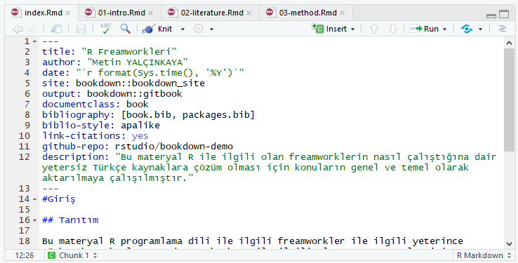
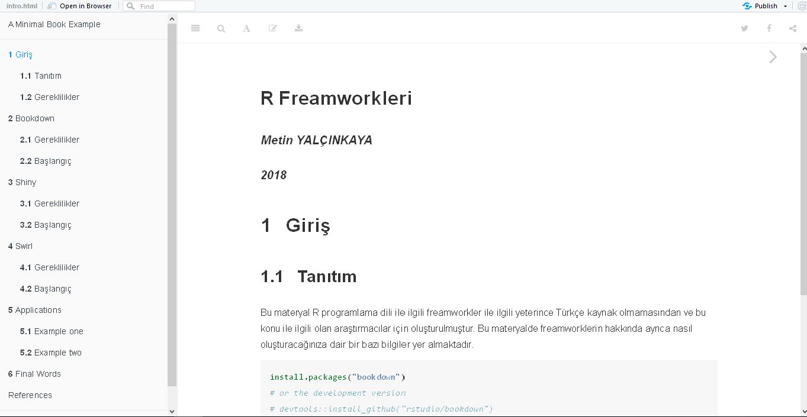
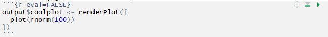
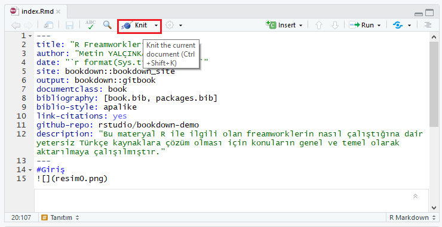
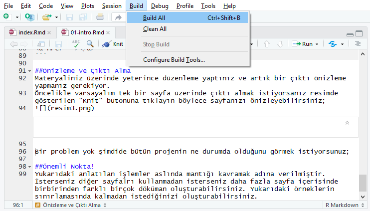

# Bookdown {#intro}

Bookdown Rmarkdown üzerine kurulu bir kitap, makale oluşturmanızı sağlayan bir R freamworküdür. Resmi sitesinde tanımlandığı şekilde;

"Bookdown, şekil / tablo başlık numaralandırma ve çapraz referanslar gibi kitap yazma ile ilgili birkaç önemli eksik özelliği ekleyerek ve HTML widget'larını veya Parlak uygulamaların gömülmesini içerir. Tüm çıktı biçimleri için (PDF, HTML ve EPUB, vb.) Her şeyi yapmaya çalıştık, böylece okuyucularınız okumak için en sevdikleri dosya formatını seçebilirler. Bookdown paketi R kullanılarak geliştirilmesine rağmen, kitabınızın R ile ilgili olması gerektiği anlamına gelmez. Kesinlikle şiirleri veya romanları yazabilirsin!"

gibi bir açıklamaları bulunur.

##Gereklilikler

RStudio'yu açıp konsol kısmına aşağıdaki komutu yapıştırarak gerekli paketlerin kurulmasını sağlayabilirsiniz;

```{r eval=FALSE}
install.packages("devtools")
  devtools::install_github("rstudio/bookdown")
```

```{r eval=FALSE}
install.packages("bookdown")
```
paketler ile işimiz bittiğine göre şimdide bir template dosyası indirmemiz gerekiyor. [Buradan](https://github.com/rstudio/bookdown-demo) template dosyasını indiriniz.

##Başlangıç

İlk olarak indirdiğimiz .zip dosyasını çıkartıyoruz. Bu dosya içerisinde bir template olarak hazırlanmış örnek bir kitap yer almaktadır.

**index.Rmd**  
Bu dosya materyalinizin kapak kısmı denilebilir. Bu kısım içerisinde kitap hakkında bilgi, yazar, yıl gibi bilgiler yer alabilir.
Aşağıdaki resimlerin ilkinde index.Rmd dosyasının RStudio ile kodlandığı alan gösterilmektedir.




Burada ise Rstudio içerisindeki düzenlemelerden sonra kitabın önizlemesi gösterilmektedir.




**intro.Rmd**  
Bu bölüm adındanda anlaşılacağı üzere giriş kısmıdır. Bu bölüm içerisinde öğrenene temel bilgiler verilmektedir.

##Düzenleme  
Yukarıdaki temel bilgileri aldığınıza göre sıra şimdi dosyaları düzenleme aşamasına geldi. Dosyalar Rmarkdown ve markdown ile düzenleme yapılarak sayfaları oluşturulur. Rmarkdown ile markdown arasında birkaç farklılık dışında başka birşey yoktur. Aşağıda ise kitabınıza yapabileceğiniz düzenlemelerin nasıl olduğu gösterilmektedir.

###Başlık
Materyaliniz içerisindeki başlıklandırma işlemlerini yapmanız için kullanılır. "#" simgesi kullanılarak yapılır ve aynı h1...h6 gibi # sayısı arttırılarak başlık belirlenir.
```{markdown}
##Başlık1
###Başlık2
####Başlık3
```

###Link
Metniniz içerisinde kelimeye bir url eklemeniz gerektiği durumlarda kullanabilirsiniz. Köşeli parantezler içerisine metin girilir, hemen yanına boşluk bırakılmadan parantez açılır ve url adresi girilir.
```{markdown}
[Link Verilecek Metin](URL Adresi)
```

###Liste
Adındanda anlaşılacağı üzere bir nesne grubunu listelemeniz gereken durumlarda kullanabilirsiniz. Listeyi oluşturmak için "+" işareti veya sayısal olarak listelemeniz gerekiyorsa "1." den başlayarak arttırarak listenizi oluşturabilirsiniz.

```{markdown}
+ilk madde
+ikinci madde
```

###Kod Ekleme & Renklendirme
Bu alan html içerisinde en zor olan alanlardan birisi bir metin içerisinde bir sürü span ile farklı farklı cssler vererek düzenleme yapılıyor fakat markdown sadece üç nokta içerisine hangi kodu yazacağınızı belirtip yazabiliyorsunuz;



###Tablo
Tablolama yapmanız gereken durumlarda aşağıdaki kod bloğunu kullanabilirsiniz;

```{markdown}
| Tables        | Are           | Cool  |
| ------------- |:-------------:| -----:|
| col 3 is      | right-aligned | $1600 |
| col 2 is      | centered      |   $12 |
| zebra stripes | are neat      |    $1 |
```

Tirelerin kullanıldığı blok bir üst bloğun başlıklar olduğunu belirtiyor. Çıkıtısı da aşağıdaki gibi olacaktır;

| Tables        | Are           | Cool  |
| ------------- |:-------------:| -----:|
| col 3 is      | right-aligned | $1600 |
| col 2 is      | centered      |   $12 |
| zebra stripes | are neat      |    $1 |

###Resim
Yazınız içerisinde eklemeniz gereken resimleri aşağıdaki kod bloğu ile ekleyebiliriz.

```{markdown}

```

###Daha Fazlası
Daha fazla içerik eklemek için Rmarkdown ingilizce kaynağı olan [bu adresi](https://rmarkdown.rstudio.com/authoring_pandoc_markdown.html#pandoc_markdown) ziyaret edebilirsiniz.

##Önizleme ve Çıktı Alma
Materyaliniz üzerinde yeterince düzenleme yaptınız ve artık bir çıktı önizleme yapmanız gerekiyor.  
Öncelikle varsayalım tek bir sayfa üzerinde çıktı almak istiyorsanız resimde gösterilen "Knit" butonuna tıklayın böylece sayfanızı önizleyebilirsiniz;


Bir problem yok şimdide bütün projenin ne durumda olduğunu görmek istiyorsak "Build" menüsü altında "Build All" ile tüm projenin hazırlanmasını sağlıyoruz ayrıca böylece sitenin html dosyalarının hepsinin hazırlanmasını sağlıyoruz (bunlar _book klasörü içerisinde yer alır.) daha sonra bir önceki resimde olduğu gibi "Knit" butonuna tıklayarak kitabın her menüsünü rahatlıkla inceleyebilir veya klasör içerisindeki html dosyalarını bir tarayıcı üzerinden görüntüleyebilirsiniz;



##Önemli Nokta!
Yukarıdaki anlatılan işlemler aslında mantığı kavramak adına verilmiştir. İsterseniz diğer sayfalrı kullanmadan isterseniz daha fazla sayfa içerisinde birbirinden farklı birçok döküman oluşturabilirsiniz. Yukarıdaki örneklerin sınırlamasında kalmadan istediğinizi oluşturabilirsiniz.
