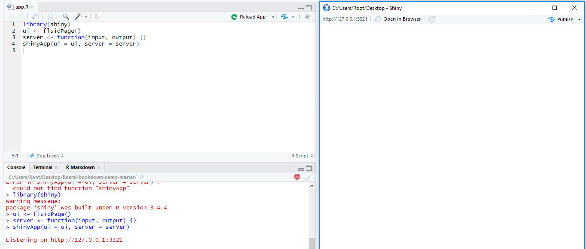
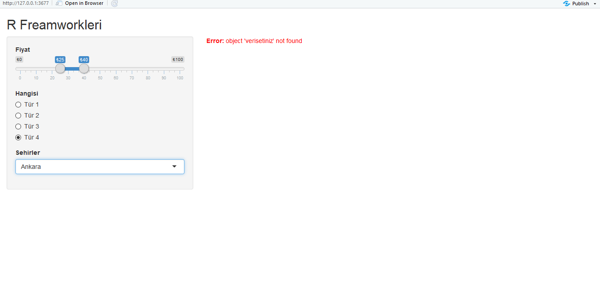
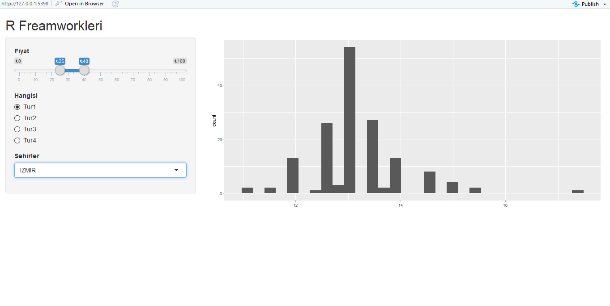

# Shiny
Shiny etkileşimli web sayfalarını oluşturmanıza olanak sağlayan RStudio paketidir. R kullanıcılarının yöneliktir ve html,css,js bilmenize gerek yoktur.  
Shiny ile oldukça fazla şey yapabilirsiniz: etkileşimli bir web sayfası yapmanın kolay bir yolu olarak düşünün ve bu web sayfası R ile sorunsuz bir şekilde etkileşime girebilir ve R nesnelerini (R'de yaptığınız her şeyin grafikleri, tabloları) gösterebilir.

##Gereklilikler
Shiny kullanabilmek için aşağıdaki paketi öncelikle yüklemelisiniz.

```{r eval=FALSE}
install.packages("shiny")
```

Ayrıca uygulama için kullanabileceğimiz veri setini [buradan](https://deanattali.com/files/bcl-data.csv) indirelim.

##Başlangıç
Shiny uygulamaları iki bölümden oluşur. Bir bölümde kullanıcının etkileşime girdiği web sayfası birde uygulamaya güç veren bir sunucu tarafı olarak uygulamayı yazmanız gerekiyor.
Kullanıcı arayüzü, kullanıcının göreceği bir web dokümanıdır, Shiny’in işlevlerini kullanarak yazdığınız HTML’dir. Kullanıcı Arayüzü, uygulamanın düzenini oluşturup tüm şeylerin nereye gittiğini tam olarak söylemekle sorumludur. Sunucu, uygulamanın mantığından sorumludur; Kullanıcı, sayfayla etkileşimde bulunduğunda ne göstereceğini web sayfasına bildiren talimatlar kümesidir.

Şimdi bir shiny uygulaması oluşturalım;
ilk olarak shiny uygulamanızı ister tek dosya halinde ister ui,server olarak iki dosya halinde hazırlayabilirsiniz.
Tek dosya halinde oluşturmak için RStudio üzerinde oluşturduğunuz yeni dosya içerisine;
```{r eval=FALSE}
library(shiny)
ui <- fluidPage()
server <- function(input, output) {}
shinyApp(ui = ui, server = server)
```
kodları girerek shiny uygulamızın temel kodlarınız yazıyoruz._Bu noktada önemli olan eğer uygulama tek dosyada yer alacaksa adı **app.R** olmalıdır._  Bu işlemleri yaptık şimdi sıra kodu test etme aşaması var. Bunun için Rstudio üzerindeki **Run App** butonuna tıklayarak uygulamanızın çalışıp çalışmadığını test edebilirsiniz.


şeklinde bir yan pencere açılcaktır ve konsol kısmında  <span style="color:red">Listening on http://127.0.0.1:3321</span> gibi bir metin yer alıyorsa uygulamanız şuanda hiçbir problem yaşamadan çalışıyor demektir.

##Düzenleme

###Ui

####Başlık
Uygulamaya h1() ile bir başlık ekleyebiliriz, ancak Shiny ayrıca özel bir işlevi olan titlePanel() özelliğine de sahiptir. TitlePanel() işlevini kullanmak, sayfanın üst kısmına görünür büyük başlık benzeri bir metin eklemekle kalmaz, aynı zamanda web sayfasının "resmi" başlığını da ayarlar. Bu, tarayıcıdaki sekmenin ismine baktığınızda, bu başlığı göreceğiniz anlamına gelir.
Şimdiye kadar denediğiniz fluidPage() 'ın üzerine yazıp, basit bir başlık ile değiştirin.

```{r eval=FALSE}
fluidPage(
  titlePanel("R Freamworkleri")
)
```

####Sayfa Düzeni
Şimdiye kadar sadece metin ve HTML etiketlerini ekleyerek, her şeyin yapılandırılmamış olduğunu ve öğelerin tek bir sütunda birbirinin altına yığıldığını fark etmişsinizdir. Basit bir yapı eklemek için sidebarLayout() yöntemini kullanacağız. Daha küçük bir kenar çubuğu ve daha büyük bir ana paneli ile basit bir iki sütun düzeni sağlar. Uygulamamızı, kullanıcının kullanabileceği tüm girişlerin kenar çubuğunda olacak ve sonuçları sağdaki ana panelde gösterilecek şekilde oluşturacağız.

titlePanel() kodundan sonra aşağıdaki kodu ekleyiniz.
```{r eval=FALSE}
sidebarLayout(
  sidebarPanel("Burada girdiler yer alacak"),
  mainPanel("Çıktılar bu tarafta olacak")
)
```
fluidPage() etiketi içerisindeki komutlar birbirinden virgül yardımı ile ayrılır.

Bu ana kadar yazdığımız kodlar şöyle oluyor;
```{r eval=FALSE}
library(shiny)
bcl <- read.csv("sizin_verisetiniz.csv", stringsAsFactors = FALSE)

ui <- fluidPage(
  titlePanel("R Freamworkleri"),
  sidebarLayout(
    sidebarPanel("Burada girdiler yer alacak"),
    mainPanel("Çıktılar bu tarafta olacak")
  )
)

server <- function(input, output) {}

shinyApp(ui = ui, server = server)
```

####Girdiler
Girişler, kullanıcıların Shiny ile etkileşim kurmanın bir yoludur. Shiny, kullanıcının bir uygulama ile sahip olabileceği birçok türde etkileşimi desteklemek için birçok girdi işlevi sağlar. 

textInput() kullanıcının metin girmesine izin vermek için kullanılır, numericInput() kullanıcının bir sayı seçmesine izin verir, dateInput() bir tarih seçmek içindir, selectInput() bir seçim kutusu (bir açılır menü) oluşturmak içindir.

#####SliderInput()
Bir fiyat aralığında sayı girilmesine sağlayalım. Bunun için sliderInput() ve numericInput() kullanabiliriz. Eğer numericInput kullanırsak en az iki giriş kullanmamız gerekecek sınırlama için fakat sliderInput ile bir aralık belirleyebileceğimiz için sliderInput kullanacağız.

```{r eval=FALSE}
sliderInput("fiyatGirdisi", "Fiyat", min = 0, max = 100,
            value = c(25, 40), pre = "₺")
```
value değeri içerisinde default veriyi belirliyoruz ayrıca burada bir fiyat aralığı olduğu için iki tane veri belirlememiz gerekiyor.

#####RadioButtons()
radioButtons() için bir çeşit metin girişi istiyoruz. Ancak kullanıcının özgürce metin girmesine izin vermek istemiyoruz çünkü kullanıcıyı sadece birkaç seçenek ile sınırlamak istiyoruz. Amacımız için radyo düğmelerini veya bir seçim kutusunu kullanabiliriz. Şimdi sadece birkaç seçenek olduğundan radyo düğmeleri kullanalım, bu yüzden radioButtons() kullanımına bakalım;

```{r eval=FALSE}
radioButtons("tipGirisi", "Hangisi",
            choices = c("Tür 1", "Tür 2", "Tür 3", "Tür 4"),
            selected = "Tür 4")
```

bu kodları sidebarPanel() kodu içerisine ekliyoruz. Ayrıca virgül ile ayrımayı unutmamız gerekiyor.

#####SelectInput()
selectInput() varsayalım bir sehir seçtimek istiyoruz bu durumda en uygun giriş tipi muhtemelen seçim kutusudur. SelectInput() ile bir giriş işlevi oluşturalım. Şimdilik sadece Ankara, Istanbul, Izmir ve Bursa gibi seçenekler sunalım;

```{r eval=FALSE}
selectInput("sehirSecimi", "Sehirler",
            choices = c("Ankara", "Bursa", "Istanbul","Izmir"))
```

#####Daha Fazlası
Yukarıdakilerden daha fazla widget ihtiyacınız olursa [buradan](https://shiny.rstudio.com/tutorial/written-tutorial/lesson3/) ve [buradaki](https://shiny.rstudio.com/tutorial/written-tutorial/lesson4/) ingilizce kaynaktan yararlanabilirsiniz.

###Server
Bu alanda daha çok düzenleme dışında ne yapacağımızla ilgileneceğiz yani seçilen parametre sonucunda uygulmayı nası çalıştıracağımızı inceleyeceğiz.

Öncelikle aşağıdaki koda bakalım;
```{r eval=FALSE}
output$coolplot <- renderPlot({
  plot(rnorm(100))
})
```

Bu basit kod ilk iki kuralı gösterir: renderPlot() işlevinin içinde bir çizim oluşturuyoruz ve çıktı listesindeki coolplot'a atıyoruz. Coolplot bir plotOutput olarak tanımlandığından, renderPlot işlevini kullanmalıyız ve renderPlot işlevinin içinde bir çizim oluşturmalıyız. Yukarıdaki kodu sunucu işlevinin içine eklerseniz, uygulamada 100 rastgele nokta içeren bir alan görmelisiniz.

Şimdi ggplot kullanarak bir görselleştirme yapalım. Hem değerlerimiz arasında değişiklik yaptığımızda hem de filtreleme işlemini kullanacağımız ayrıca ggplot ile görselleştirme yapacağımız için uygulamamızın en üstüne aşağıdaki kütüphaneleri ekleyelim;
```{r eval=FALSE}
library(ggplot2)
library(dplyr)
```

**Not:** Eğer hata alıyorsanız paketlerin sisteminizde kurulu olup olmadığına bakınız.

dplyr kütüphanesini filtreleme işlemleri için aktifleştirdik. Şimdi gelelim seçimler ile kullanıcı arayüzünde değişiklikler sağlamaya;

```{r eval=FALSE}
output$coolplot <- renderPlot({
  filtered <-
    verisetiniz %>%
    filter(Fiyat >= input$fiyatGirdisi[1],
           Fiyat <= input$fiyatGirdisi[2],
           Hangisi == input$tipGirisi,
           Sehirler == input$sehirSecimi
    )
  ggplot(filtered, aes(veriseti_icindekialan)) +
    geom_histogram()
}))
```

Yukarıdaki kod bloğu içerisinde filtered diye bir alan oluşturduk ve seçimlerimizi bu değişkende topladık. "verisetiniz" yazan alan eğer uygulamaya bir veri seti eklerseniz bu alana ekleyeceğiniz anlamına gelir. (Verisetini burada değil kodun üst kısımlarında tanımlayıp sadece atadığınız değişken adını yazmanız gerekir.) ggplot içerisinde ise değişkenlerimiz ile beraber varsa verisetine ait alan ile birleştirilip bir görsel oluşturulur. Bu kodlar ile beraber kullanıcıya interaktif bir web  uygulaması kullanması sağlanmış olur.

####Genel Bakış
```{r eval=FALSE}
library(shiny)
library(ggplot2)
library(dplyr)

bcl <- read.csv("bcl-data.csv", stringsAsFactors = FALSE)

ui <- fluidPage(
  titlePanel("R Freamworkleri"),
  sidebarLayout(
    sidebarPanel(
      sliderInput("fiyatGirdisi", "Fiyat", min = 0, max = 100,
            value = c(25, 40), pre = "₺"),
      radioButtons("tipGirisi", "Hangisi",
            choices = c("Tür 1", "Tür 2", "Tür 3", "Tür 4"),
            selected = "Tür 4"),
      selectInput("sehirSecimi", "Sehirler",
            choices = c("Ankara", "Bursa", "Istanbul","Izmir"))
    ),
    mainPanel(
      plotOutput("coolplot"),
      br(), br(),
      tableOutput("results")
    )
  )
)

server <- function(input, output) {
  output$coolplot <- renderPlot({
  filtered <-
    verisetiniz %>%
    filter(Fiyat >= input$fiyatGirdisi[1],
           Fiyat <= input$fiyatGirdisi[2],
           Hangisi == input$tipGirisi,
           Sehirler == input$sehirSecimi
    )
  ggplot(filtered, aes(veriseti_icindekialan)) +
    geom_histogram()
}

shinyApp(ui = ui, server = server)
```


Aşağıdaki resimde yukarıdaki kodun çalıştırılmış halini inceleyelim.




Bu resimde bir veri setimiz olmadığı için uygulama hata veriyor bir veri seti ekleyip tekrar deneyelim;



görüldüğü üzere uygulamamız çalışıyor.

##Yayınlama
Uygulamanızı hazırladınız ve web üzerinde yayınlamanız gerekiyor işte bu noktada [shinyapps.io](http://www.shinyapps.io/) size belli bir sayıya kadar barındırma hizmeti sunar. RStudio entegre olan bu hizmet size uygulamanız ile ilgili istatislikler verir. 

Öncelikle Uygulamanızı shinyapps.io üzerinde barındırma uygulaması, uygulamanızı çevrimiçi hale getirmenin kolay ve önerilen yoludur. [shinyapps.io](http://www.shinyapps.io/) adresine gidin ve yeni bir hesap için kaydolun. Uygulamanızı yayınlamaya hazır olduğunuzda, RStudio'daki “Publish Application” düğmesini tıklayın ve talimatlarını uygulayın. İlk kez bir çift paket yüklemeniz istenebilir. Shinyapps.io'ya başarılı bir yüklemeden sonra, uygulamanıza tarayıcıda yönlendirileceksiniz. Bu URL’yi çevrenize göstermek için yazdığınız harika bir uygulama olarak kullanabilirsiniz.


