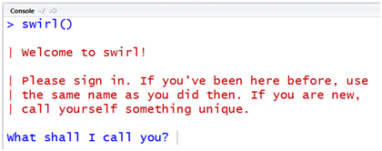

# Swirl
Swirl diğerlerinden farklı olarak isterseniz R derslerini öğrenebileceğiniz isterseniz ders olşturup insanların bu dersler sayesinde R konularını öğrenmelerini sağlayabileceğiniz freamworktür.

##Gereklilikler

RStudio'yu açıp konsol kısmına aşağıdaki komutu yapıştırarak gerekli paketlerin kurulmasını sağlayabilirsiniz;

Dersi öğrenmek için;
```{r eval=FALSE}
install.packages("swirl")
```
Ders oluşturmak için;
```{r eval=FALSE}
install.packages(c("swirl", "swirlify"))
```
##Başlangıç

###Dersi Öğrenmek İçin
Ders öğrenmek için;
```{r eval=FALSE}
library(swirl)
```

kütüphanesini etkinleştirdikten sonra
```{r eval=FALSE}
swirl()
```

kodunu çalıştırarak dersi aktifleştirelim ve içersindeki dersi öğrenmeye başlayalım.


###Ders Oluşturmak İçin
Gerekli paketleri indirdik ve şimdi ders oluşturmamız gerekiyor. İlk olarak "swirlify" kütüphanesini aktif hale getirmemiz gerekiyor.
```{r eval=FALSE}
library(swirlify)
```
Kütüphane aktifleştirmede bir sıkıntı yoksa sırada dersimizi oluşturmaya geldi. "new_lesson()" komutu ile yeni ve ham bir ders oluşturabiliriz.

```{r eval=FALSE}
new_lesson("KursunAdi", "DersinAdi")
```
şeklinde dersimizi oluşturabiliriz. Bu komutu aktifleştirdikten sonra aşağıdaki gibi bir dosya sistemine sahip olacağız.
```{r eval=FALSE}
─ DersinAdi
  └─ KursunAdi
     ├─ lesson.yaml
     ├─ initLesson.R
     ├─ dependson.txt
     └─ customTests.R
```
Peki bu dosyalar içerisinde neler yer alıyor.  
**lesson.yaml:** Soruların yazıldığı alan burasıdır. Sorular yazılır eğer tanımlı ise bir fonksiyona yönlendirilir veya kendi içerisinde basit bir şekilde değerlendirilir.  
**initLesson.R:** Genellikle veri yüklemek veya çevresel değişkenler oluşturmak için kullanılan ders başlamadan önce çalışan bir R betiğidir.  
**depenson.txt:** Bir veriyi tanıtmak için kullanılan R betiğidir.  
**customTests.R:** Öğrencilerin cevapları için kendi testlerinizi yazabileceğiniz yerdir.

##Düzenleme

###Dersi Öğrenmek İçin
Gelen paket içerisindeki dersler yetersiz geldiğinde aşağıdaki kodu kullanark yeni ders ekleyebilirsiniz.
```{r eval=FALSE}
library(swirl)
install_course("Kurs_adi")
swirl()
```

Eğer dersi indirdiyseniz;
```{r eval=FALSE}
library(swirl)
install_course_zip("path/to/file/here/dosya_adi.zip", multi=TRUE, 
                   which_course="Kurs_adi")
swirl()
```

ve dersi kaldırmak için;
```{r eval=FALSE}
uninstall_course("Kurs_adi")
```

###Dersi Oluşturmak İçin
####Lesson.yaml
Yukarıda bahsedildiği gibi soruların ve cevapların yer aldığı bölüm aşağıdaki şekilde düzenlenir.
```{r eval=FALSE}
- Class: cmd_question
  Output: R konsolu içerisinde 2 ve 2 sayılarını toplayınız.
  CorrectAnswer: 2 + 2
  AnswerTests: omnitest(correctExpr='2 + 2')
  Hint: Just type 2 + 2.
```

####depenson.txt
Bu alanda düz metin olarak fonksiyonlar hakkında bilgi verebilirsiniz.
```{r eval=FALSE}
Bu fonksiyon ..... işlemlerini gerçekleştirmektedir.
```

####initLesson.R
Bir R betiğinde olduğu gibi değişkenlerinizi ve verilerinizi ekledeğiniz bölümün örneği aşağıdaki gibidir;
```{r eval=FALSE}
library(dplyr)

# Sayı aralığı
.ng <- 5
#Öğrenciler/Gruplar için maksimum değer
.gmax <- 8

# Kolon başlıkları değerlerdir, değer isimleri değil

set.seed(1234)
students <- data.frame(
  grade = LETTERS[1:.ng],
  male = sample(0:.gmax, .ng, replace = TRUE),
  female = sample(0:.gmax, .ng, replace = TRUE)
)
```

####customTests.R
Kendi fonksiyonalrınızı oluşturacağınız bu bölümde topladığınız verileri işlemler ile beraber çalıştırarak aldığınız sonuçları kullanıcıya döndüreceğiniz dosyadır. Örne olarak;
```{r eval=FALSE}
# Bir kullanıcının komuta göre doğrudan girdiği veya hesaplandığı veriyi alın
getVal <- function(){
  getState()$val
}
```

##Yayınlama
Kendi dersinizi oluşturdunuz ve artık bunu öğrenmek isteyenlere sunmak istiyorsunuz o halde dersi bir dosya halinde nasıl çıktı alacağımıza bir bakalım;
```{r eval=FALSE}
set_lesson()
```
bu komut ile dersinizi ayarlamanız gerekiyor daha sonra
```{r eval=FALSE}
pack_course()
```
komutu ile **.swc** uzantılı bir dosya oluşturduk. Bu dosyayı normal bir dosya gibi paylaşabilirsiniz ve ihtiyacınız olduğunda **install_course()** komutu ile dersi çalıştırabilirsiniz.
